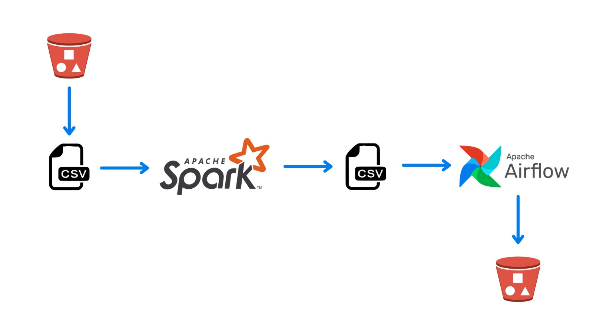

# Analysis on Olist data with Apache Airflow

I uploaded the data to the bucket. By providing Bucket access, I downloaded the data to my local computer and obtained the desired output data. I uploaded the obtained data back to the bucket with Apache Airflow.

